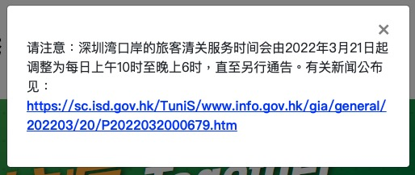

# 赴hk须知

## 到港隔离政策

入境政策疫情之下，香港特区政府会针对疫情最新动态持续更新入境政策，请您务必关注香港特区政府最新通告 https://www.coronavirus.gov.hk/sim/inbound-travel.html#boardingrequirements

### 一般方式

**于登机 / 到港当天或之前 14 天只曾逗留在内地（广东省以外）、澳门的抵港人士**

根据香港特区政府官方公布的疫苗气泡政策：从 2022 年 2 月 5 日起，于登机 / 到港当天或之前 14天只曾逗留在内地（广东省以外）、澳门和台湾的抵港人士【并非循「回港易」或「来港易」计划的到港人士】，如已完成疫苗接种，距离接种所有建议剂量的新冠疫苗后的次日起计已过 14 天，并持有预定抵港当天或当天之前 3 天之内采样进行的 2019 冠状病毒病聚合酶连锁反应（PCR）核酸检测阴性结果证明及疫苗接种记录，其强制检疫期只需要七日，抵港后于指定地点（家居、酒店或其他住所）接受隔离。强制检疫结束后须进行七日自我监察，并于抵港后第 3 天、第 5 天及第 12 天进行病毒检测。如不符合以上条件，则不能享受疫苗气泡政策。凡入境人士务必按照最新规定进行强制检疫，未按要求入境会触犯法律。

*注 1*：疫苗气泡政策简略图（持续更新）https://www.coronavirus.gov.hk/pdf/concise_guide_vaccinated_travellers_CHI.pdf

*注 2*：进行 2019 冠状病毒病聚合酶连锁反应（PCR）核酸检测的检测机构须：

1. 获粤港／港澳两地政府认可 ( 在广东省的医疗或检测机构【广东省内所有能够上载 RT-PCR 核酸检测阴性结果到「粤康码」系统的医疗检测机构】/ 在澳门的医疗或检测机构 / 在香港的医疗或检测机构 )；

2. 获中华人民共和国国家卫生健康委员会认可 ( 名单可于「国务院客户端」小程序中的「核酸检测机构查询」功能找到：http://bmfw.www.gov.cn/hsjcjgcx/index.html)。

注 3：认可的疫苗名单（持续更新）https://www.coronavirus.gov.hk/pdf/list_of_recognised_covid19_vaccines.pdf

*注 4*：疫苗接种记录要求

1. 由香港发出的接种疫苗纪录，或接种疫苗当地的相关主管当局或其认可机构发出，并载有相关已接种疫苗到港人士姓名（所载姓名须与相关已接种疫苗到港人士的有效旅游证件所示的姓名相符）疫苗接种纪录。该接种纪录须以中文或英文显示以下资料：相关到港人士已接种 2019 冠状病毒病疫苗及最后一剂的接种日期；及该已接种的疫苗的名称或其药物上市许可持有人 (market authorisation holder) 或生产商的名称；
2. 如疫苗接种纪录既非采用中文，亦非采用英文，或并无载有上述所有资料，则须呈交由接种疫苗当地的相关主管当局或其认可机构发出并载有相关已接种疫苗到港人士姓名（所载姓名须与相关已接种疫苗到港人士的有效旅游证件所示的姓名相符），并显示上述全部资料的中文或英文确认书，该确认书须与上文所述的疫苗接种纪录一并呈交。

*注 5*：" 指定检疫酒店 " 不适用于只曾在中国内地或澳门逗留的人士，请选择其他酒店检疫。

*注 6*：经机场抵港人士，须在抵港当日检测待行。

**注意事项**

如果从其他省份过来，准备去酒店隔离7-14天的同学。

- 切记不要预订政府 指定检疫酒店计划中的酒店。
- 切记不要预订政府 指定检疫酒店计划中的酒店。
- 切记不要预订政府 指定检疫酒店计划中的酒店。

重要的事情说三遍。这个计划中的酒店是给从境外回港的人预订的，闭环管理。

### 来港易

**「来港易」计划**

自 2021 年 9 月 15 日起，在入境香港当天或当天之前 14 天不曾到过香港、广东省或澳门以外的其他地区，以及任何载列于「回港易 / 来港易计划暂不适用风险地区名单」的地区，可透过来港易计划的网上系统预约入境香港名额。成功预约名额的非香港居民必须按预约的指明日期和口岸入境香港，并在入境香港时持有在入境当天或当天之前三天内取得的有效核酸检测阴性结果证明，满足条件者获豁免强制检疫，惟他们同时亦需符合《若干到港人士强制检疫规例》。抵港人士可从深圳湾和港珠澳大桥入境，两个口岸每天配额均为 1000 人。

*注 1*：「来港易」计划官网公告详情：https://www.coronavirus.gov.hk/sim/come2hk-scheme.html

*注 2*：「来港易」网上预约系统（2021 年 9 月 15 日的零时起，逢星期三零时起，开放下轮预约名额以供申请）：https://www.quotabooking.gov.hk/nonresidents_cbt_booking/index_hk_sc.jsp

*注 3*：「回港易 / 来港易计划暂不适用风险地区名单」的地区（持续更新）：https://www.chp.gov.hk/files/pdf/at_risk_places_temporarily_inapplicable_under_return2hk_come2hk.pdf

**注意事项**

1. 该14天不包括该人士在广东省或澳门当地根据当时的要求而须完成的强制检疫期。例如，若一名人士到达广东省后在2021年9月14日完成强制检疫，则「到达香港的当日或在该日之前的14日」须于其强制检疫期满后的2021年9月15日起计算。

2. 为了加速过关时间，港府强烈建议赴港人士提前24小时透过「粤康码」或「澳康码」的「转码」功能传送到卫生署电子健康申报系统，并填妥及提交电子健康申报表，以获批「来港易」绿色二维码。

## 出行相关资料

### 入境所需资料

登机前或从陆路口岸入境前需提前准备以下资料，可有效提升通关效率：

1. 粉签（即 Visa Label）；

2. 港澳通行证（带逗留签注）；

3. 新冠疫苗接种证明；

4. 黑码：微信小程序【海关旅客指尖服务】按信息填报即可获取；

5. 健康申报获取粉码：申报方式如下陆路入境：微信小程序【粤省事】-“通关凭证”选择“港粤通关”-“入境香港申报”，最终填写完毕保存二维码截图。机场入境：申报网址 https://www.chp.gov.hk/hdf/ ，选择“香港国际机场”，最终填写完毕保存二维码截图；

6. 绿码：微信 / 支付宝的粤康码（陆路入境需准备）；

7. 72 小时核酸证明；

8. 下载安装居安抗疫 app；

9.  香港手机卡：填写资料时需要手机号（内地手机号也可以，需开通国际漫游，以便工作人员与您联系）；

10. 酒店预定确认邮件或者预定截图，以及酒店的地址（如果有）；居家隔离也是可以的，需要准备好房东的电话号码；

11.  港币现金：打车、采购会需要

### 入境程序

**陆路入境程序**

深圳的陆路口岸有 6 个，分别是罗湖、文锦渡、皇岗、沙头角、深圳湾、福田口岸。按照当前口岸政策，内地人士需由深圳湾口岸或港珠澳大桥入境香港。从深圳口岸到香港必须经历两个步骤：在内地边境办理出境手续，在香港边境办理入境手续，这两个步骤简称为「出深圳关」和「进香港关」。从深圳湾入境的大致程序如下：

1）出深圳关：过内地的安检和关口，需要的二维码：黑码（在微信小程序中搜索“海关旅客指尖服务”进行填报），之后就按照海关工作人员的指引过关就好。

2）进香港关：

第一步：出示“粤省事”黑码，之后是粉码、粉签、港澳通行证和新冠疫苗证明，然后工作人员还会给您三个接唾液的小瓶子，上面会给您标上要送检的时间，可以扫描袋子上的二维码选择上门来取，在此窗口还要求您用电话打给他们的号码以确保您的手机可以打通。

第二步：去到另外一个窗口带手环，下载抗疫居家 app，了解手环激活说明等。

第三步：排队过关。在经过一个通道时，会让您填一下资料收集小纸条，出通道时放在收集箱中，就过关完成了。过关后请特别保存好香港海关工作人员给您打印的回执，即 landing slip，在抵达学校后多个环节中会用到。第四步：乘坐的士 / 巴士（建议乘坐的士）前往市区开始隔离。

**从机场入境程序**

从机场入境的大致程序如下：

1. 简单登记您的个人信息，每人发一个胸卡和一个样品采集袋。该胸卡一直到离开机场都是需要戴着，上面有您的核酸检测编号；

2. 戴着胸卡去做咽拭子 + 鼻拭子检测；

3. 检查您的电话号码能不能打通；检查疫苗接种证明以及酒店预定证明；

4. 发放强制检疫令以及文件袋，里面有两个样本采集袋，在指定要求的时间采集自己的样本，送去指定地点。可以扫描袋子上的二维码选择上门来取；

5. 带上居安抗疫手环，检查居安抗疫app 有没有下载好；

6. 在指定地点等候结果。如果结果阴性，会有工作人员过来告诉您可以走了，同时给您的检疫令盖上 checked

7. 乘坐的士 / 巴士（建议乘坐的士）前往市区开始隔离。在香港有住所的抵港人士可以进行居家隔离，但注意学校宿舍不能用于隔离。在香港无住所的抵港人士需入住香港政府认可的酒店进行隔离。

注：" 指定检疫酒店 " 不适用于只曾在中国内地或澳门逗留的人士，请选择其他酒店检疫。预约酒店时请与酒店人员确认清楚是否可以用于隔离，并取得酒店预约证明。

### 材料申请

**香港入境签证 / 粉签**

可以在 香港特区政府入境事务处 网站上下载并提交申请表格，网站链接为 https://www.immd.gov.hk/hkt/index.html 一般 四个月 出结果

**港澳通行证**

需 本人 在 户籍所在地 的 户籍管理中心 / 出入境办事处 持有 中国大陆居民身份证 申领

**逗留签注**

需 本人 在 户籍所在地 持有 中国大陆居民身份证、港澳通行证、香港入境签证 等文件 申请签注，可以跟港澳通行证同时办理，节约时间

**手机号开通国际漫游**

符合条件的联通用户可通过以下方式自助申请：
【1】登录网上营业厅http://www.10010.com，首页点击“出境漫游”；
【2】登录手机营业厅，点击服务＞办理＞国际、港澳台业务。
以上路径以页面查询及办理页面实际显示信息为准。部分地区及套餐不支持以上方式办理，建议您可前往归属地联通自有营业厅咨询，具体以归属地联通政策为准。

## 必备物品

### 手机卡

香港电信运营商完全不同于内地，采用全市场运营模式。但是电话卡多种多样，哪种卡对比国内都贵……还有香港的电信运营商的上台政策很不灵活。本文教大家如何选择和办理。

什么是上台？

在香港，我们经常会听到人去办理手机卡时说是去上台。其实上台的意思就是大家所熟知的“和运营商签约月费套餐合约”，这个合约期一般是12或24个月。 因为办理上台的手机套餐是实名制登记入网的，所以办理时通常需提供：

- 香港身份证（或临时的香港身份证）
- 内地身份证
- 港澳通行证
- 录取通知书
- 学生签证
- 学生证
- 住址证明（若没有，运营商会寄一封信到大家的住址，这封信以后可以当成你的住址证明）

注意：在香港通过上台办理电话卡必须有香港住址才可办理。

办理上台后，就必须履行合同内的条款，即时缴费，不能临时终止合同。比如你签约了24个月，你用了12个月后不想用了，也是需要缴满剩下一年的费用，才能取消电话卡。不然，运营商运将会给大家寄律师信，这将直接影响大家在香港的信用度！

在办理电话卡时，如果大家有什么不明白的地方，是可以去运营商的店面里咨询的，这样办理起来会更加方便快捷。

**除了上台，还有其他的选择吗？**

如果我不想上台，还有其他办法可以使用香港电话卡吗？当然有！除了上台，同学们还可以选择储值卡。储值卡可以直接购买，如有需要的话就往卡里充钱，不需要登记任何身份资料就可以使用。费用是按拨打的通话时间、短信、上网时间及流量计算，直接在卡的余额里扣除。

优点：不需要签约，想取消也不需要申请，直接停用就好了

缺点：流量费用较高，不适合上网量大的用户

结论：对于短期停留香港的朋友们，储值卡是一个不错的选择；但对于在香港长期读书的同学们，上台会更划算

怎么办上台？

目前香港排名前四的通讯运营商，分别是：

l 电讯盈科 PCCW：旗下有多个品牌，1010，one2free，PCCW-HKT，CSL（最近收购）。

l 和记电讯 3HK ：和记电讯，简称 three，3。

l 数码通 Smartone ：数码通-沃达丰。

l 中国移动香港 CMHK：华润万众 Peoples，调整手动搜索网络会有 CMHK 和 China Mobile HK 两个信号源。

l 联通也有香港分公司，HKUnicom，但没看到周边有谁在用，也没看到信号源。还有一些小型的运营商，租赁大型运营商的基站。类似国内的虚拟运营商。

名词专业术语解释

上台：办卡，类似全球通一样进行实名制登记入网，相当于你在一家银行里开户。

储值卡：号码卡，类似动感地带那些不记名随用随丢的卡，一张卡包含号码和一定的金额。

增值卡：充值卡，往储值卡里存钱的，有实体卡，也可以在任意 7-11 充值。

携机上台：自己拿着手机加入这家运营商，会享受优惠。

买机上台：买这家运营商手机和号码，会享受优惠。

月费服务计划：月套餐，月租，包含通话分钟，上网时长等业务。

IDD：国际直拨电话的功能，国际长途电话功能，可以拨打国内的电话（0086）。

转台：香港，换运营商是可以不需要换号的。带着手机卡和证件去营业厅办就好了。其实换来换去就是这样子，但还要知道自己用的是什么，对比过才知道，转台有优惠活动，具体也需要问一下，因为都不一样，换完记得告诉经常电话的朋友，可能朋友不知道，同一运营商优惠活动就没有，比如同一网内短信，同一网内通话时长，双方就要付费。

## 跟🐷一起的出行计划

### Plan A

*适用情况：xxx*

### Plan B

*适用情况：xxx*

### Plan C

*适用情况：xxx*

## 注意事项

1. 如果从其他省份过来，准备去酒店隔离7-14天的同学。切记不要预订政府 指定检疫酒店计划 中的酒店。切记不要预订政府 指定检疫酒店计划 中的酒店。切记不要预订政府 指定检疫酒店计划 中的酒店。重要的事情说三遍。这个计划中的酒店是给从境外回港的人预订的，闭环管理。

## 相关链接

| 名称 |网址 |
|:-:|:-:|
| 2022年中国香港求学入境，报道指南！ | https://zhuanlan.zhihu.com/p/535870727 |
| 香港特区政府 抵港人士的检疫须知 | https://www.coronavirus.gov.hk/sim/inbound-travel.html |
| [来港易]计划申请 | https://www.quotabooking.gov.hk/nonresidents_cbt_booking/hk/index_sc.jsp |
| 来港易 - 在《若干到港人士强制检疫规例》（第599C章）下非香港居民从广东省或澳门来港豁免检疫计划 | https://www.coronavirus.gov.hk/sim/come2hk-scheme.html |
| GovHK香港政府一站通 查詢「電子簽證」資料 | https://www.gov.hk/tc/residents/immigration/nonpermanent/evisaenquiry.htm |
| 香港政府 2022消费券计划 | https://www.consumptionvoucher.gov.hk/tc/index.html |
|  |  |
|  |  |
|  |  |
|  |  |
|  |  |
|  |  |
|  |  |
|  |  |
|  |  |
|  |  |
|  |  |
|  |  |
|  |  |
|  |  |
|  |  |
|  |  |
